# CookEasy
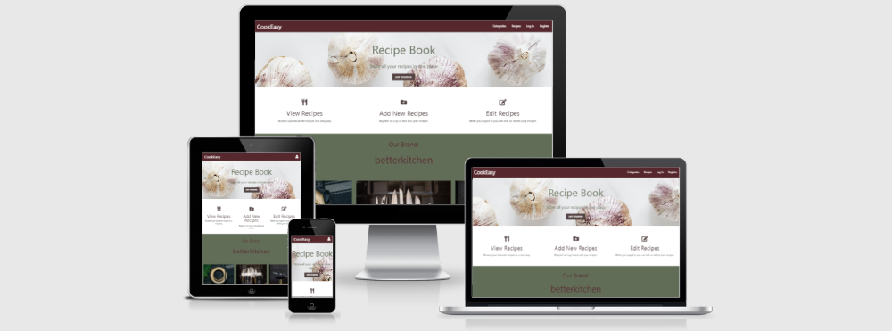

[This website](https://em-cookbook.herokuapp.com/index) is a project of website with recipes. Purpose of this project is to let user create, read, update and delete recipes. Non-registred users are able to browse recipes, while registred user are able to create and manipulate their recipes.

## UX


Goal of this website is to provide users with visually appealing recipe website, where user would be able to navigate easily. As well website promotes a brand of cooking accessories.

Note for Assessors:
* Username: admin
* Password: adminas

#### User Stories:

1. As a non-registered user I would like to browse recipes.
2. As a non-registered user I would like to be able easily register an account.  
3. As a non-registred/registered user I would like to chose a category of recipes.
4. As a non-registerd/registered user I would like to search for recipes with keyword.
5. As a non-registered/registered user, I would like to be able to browse profile of recipe's creator.
6. As a registered user I would like to view and add other user's recipe to my Favourites list.
7. As a registered user I would like to add, edit and delete my recipes.
8. As a registered user I would like to see my uploaded recipes in my profile page.
9. As a registered user I would like easily login or logout.


#### Functions(based on user stories):

 Basic requirement for this webpage is perform CRUD operations. User are able to register and login to his account. Non-registered/registered users are able to easily browse thru categories in a navigation bar (Categories dropdown), search for recipes with keyword. When recipes header link clicked, single recipe view opens up.
 Registered users are able to add, edit and delete their recipes. As well user are able to add his favourite recipe to his Favourite recipes list. User can browse thru other user's profile and see user's recipes. Only regitered users are able to add, edit and delete their recipes. Registered users are able to see all their uploaded recipes in their profile page. For registered users it's easy login and log out, by using button and form.

#### Content (based on user stories):

 * recipes page: displays all recipes. Available for all users.
 * recipe page: displays individual, chosen recipe: image, recipe name, category, creator, cuisine, cooking time, prep-time, servings, ingredients,preparation steps. If user is a creator of recipe, can click buttons to edit or delete recipe.
 * user_recipes page: displays other user recipes, linked from recipe(creator link).
 * edit_recipe page: user able edit his recipe.
 * Navigation bar for registered user: 
    * CookEasy logo: links to home/index page
    * Categories: all recipes categorised. User can choose suitable category.
    * Recipes: displays all recipes from database.
    * Add Recipe: page with form, where user are able fill in his new recipe details.
    * Profile: page which displays user's uploaded recipes.
    * Favourites: page displays Favourite recipes, which were added by user.
    * Log Out: user able to Log Out from his profile.
 * Navigation bar for non-registered user:
    * CookEasy logo: links to home/index page
    * Categories: all recipes categorised. User can choose suitable category.
    * Recipes: displays all recipes from database.
    * Log In: opens page where user fill's in his username and password
    * Register: opens page where user can fill in his details and create an account
 
## Design
 #### Colors
 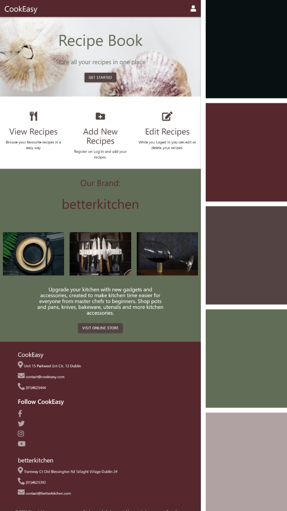

 I chose these shades to create warmth and depth. Looks elegant and at the same time reminds colors of nature.

 #### Backgrounds

 I chose background images which represents food, like herbs and peppers. In most pages I used marble table surface image.

## Wireframes and Screenshots

* [Mobile Screenshots](static/css/images/screenshots)
* [Wireframes](static/css/images/wireframes)

## Features

 ### Existing Features

 * Navbar - provides easy navigation thru the webpage, for non-registred/registred users. By using navbar user can go to any page of website. Contains logo CookEasy link, which link to index page.
 * Index page - welcomes new and current users, provides information what users can do on website. Top section greets and provides button for registration Index page promotes brand betterkichen, contains button (for design purposes, no link) to link users to betterkitchen website.
    * 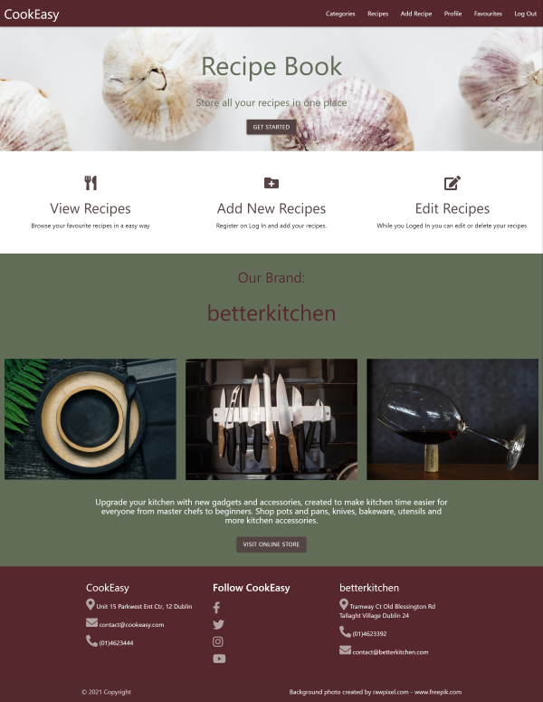
 * Recipes page - contains all users recipes which currently in database. Each recipe has a card, which contains recipe image, name, small description, number of servings, cooking time, difficulty level. Recipe name links to individual recipe view.
    * 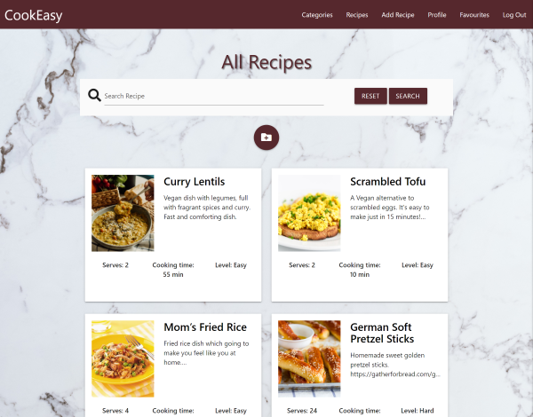
 * Categorised recipes page - contains category's name header and recipes cards, recipes displayed matches category e.g. All-in-one, Cheap Solution, Vegetarian, Vegan...
    * 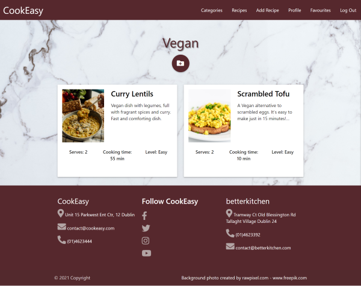
 * Recipe page - shows individual recipe, contains image, recipe name, category, creator, cuisine, cooking time, prep-time, servings, ingredients,preparation steps. If user non-registered buttons not provided. If user are not a recipe creator, page provides button with heart/broken-heart icon for user to add or remove recipe to/from his Favourite recipes list. If user is recipe creator, page provides two buttons. One button lets edit recipe, other button with trash bin icon, lets user to delete recipe.
    * 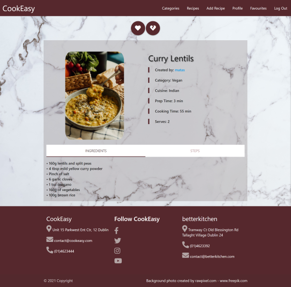
 * User Recipes page - when user opens individual recipe, she/he can click on created by: link, which links to recipe's creator profile. Which contains all creator's recipes. Page displays user's header, and recipes cards.
    * 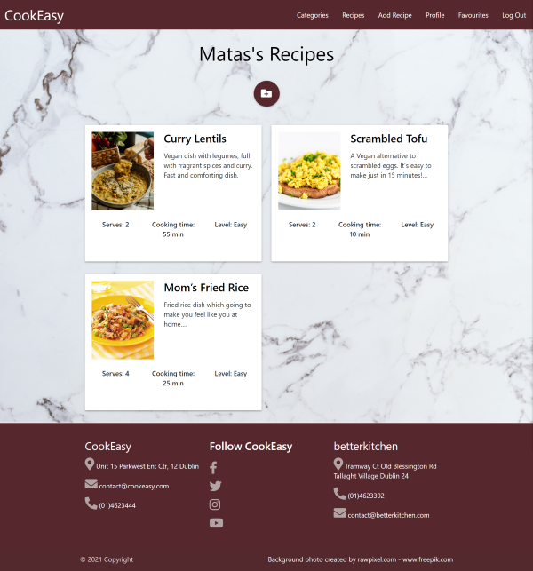
 * Profile page - contains header, button with folder icon to add recipe. Heart icon button to link user to his/hers Favourite recipes page.
    * 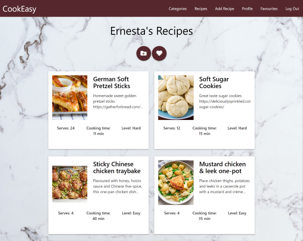
 * Favourites page - only if user registered he/she can have Favourite recipes page. Contains header, button to add recipe and recipe card with Favourite recipes.
    * 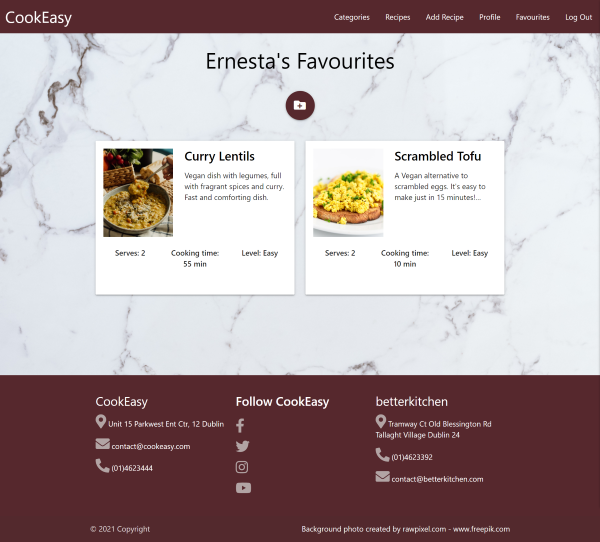
 * Add/Edit recipe pages - add recipe page has form with input fields for user to fill in new recipe details, and add recipe button. Edit recipe also contains same form, but imput fields already has content which can be modified, also contains add recipe button.
    * 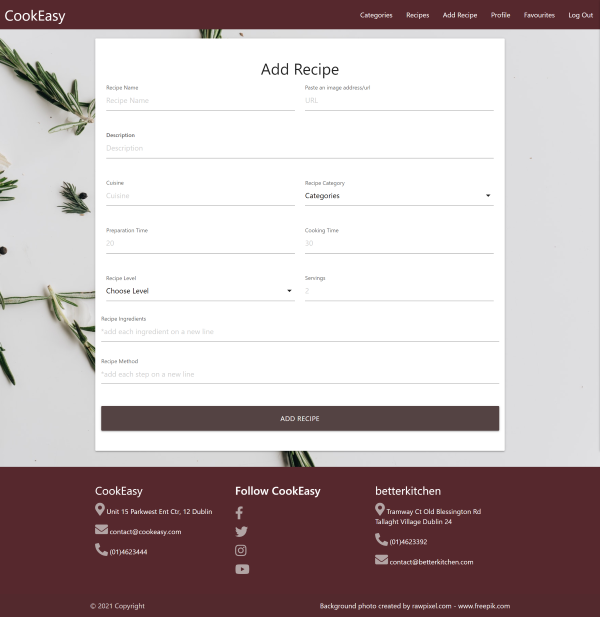
    * 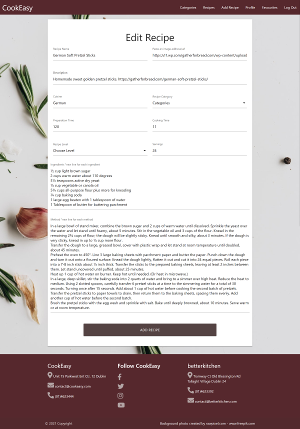
 * Register page - contains form where new user can fill in his details and create an account. Form has a link on the bottom for user to log in if she/he already registered to a website. Form also contains Register button.
    * 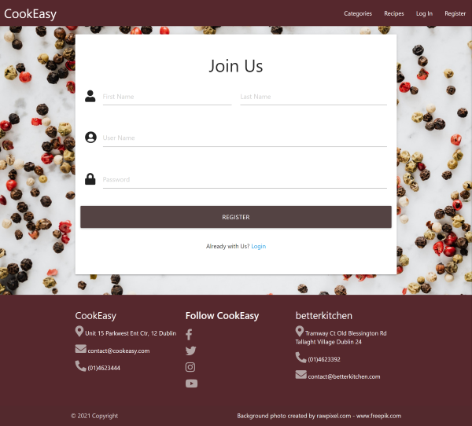
 * Login page - displays form where registered user can fill in his username and password and login to profile. Form has a link to a registration page on the bottom, for non-registered users. Form has login button.
    * 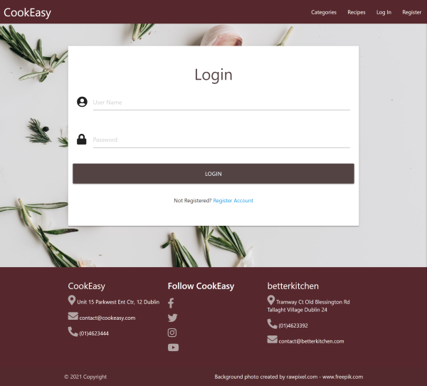
 * Footer - displays CookEasy address, phone number, and email with icons, social media links. Footer has contact details for betterkithen (promoted brand) shop. 

 ### Future Features
 * Add rating functionality, and let users leave comments for recipes.
 * Let user to change their username, email address, or reset password
 * Let user to download recipe as PDF file.

## Database

 ### Data Storage Types

 Types of data stored in database for this website:
 * ObjectId
 * String
 * Integer
 * Array

 ### Collections Data Structure
 
 #### Categories collection

```
{
	"_id": {"$oid":"6058a0b5954649aea6db0675"},
	"category_name":"All-in-one"
}
```

 #### Recipes collection

 ```
 {
	"_id":{"$oid":"606f39ae8bd1fdc354520d53"},
	"username":"admin",
	"rec_img":"https://images.pexels.com/photos/6120506/pexels-photo-6120506.jpeg?auto=compress&cs=tinysrgb&dpr=1&w=500",
	"cuisine_name":"Indian",
	"category_name":"Vegan",
	"description":"Vegan dish with legumes, full with fragrant spices and curry. Fast and comforting dish.",
	"rec_name":"Curry Lentils",
	"level":"Easy",
	"prep_time":"3",
	"cook_time":"55",
	"serves":"2",
	"methods":
		    "In a pot bring 6 cups of water to a boil. Add 160g lentils and split peas.\r\n
		    Add spices and chopped up garlic. Cook for 50 minutes on a medium.\r\n
		    In a separate pot, bring 2 cups of water to a boil. Add 100g of brown rice. Cook the rice until water is absorbed on a medium. Never mix rice during cooking.\r\n
		    Add the frozen veggies to the lentils and peas and cook for an additional 5 minutes or until veggies are equally hot as the lentils and peas.",
	"ingredients":
		    "160g lentils and split peas\r\n
            4 tbsp mild yellow curry powder\r\n
            Pinch of salt\r\n
            6 garlic cloves\r\n
            1 tsp oregano\r\n
            160g of vegetables\r\n
            100g brown rice"
}
```

#### Users collection
```
{
	"_id":{"$oid":"605e0712cf2553618f8dd984"},
	"first_name":"ernesta","
	last_name":"majute",
	"username":"admin",
	"password":"pbkdf2:sha256:150000$kpGwvqOp$1110699a8be6a22dd8fe42c277cf5b477ae36184a40f3d7bee10248162a90bca",
	"favourite_recipes":[
            {"$oid":"606f3a218bd1fdc354520d54"},
            {"$oid":"606f3a528bd1fdc354520d55"},
            {"$oid":"6071f22b60dd578467acdcae"},
            {"$oid":"606f02b3199a74252dfdbdf6"}
	]
}
```

## Technologies used

### Languages

 * [HTML5](https://www.w3schools.com/html/)
 * [CSS](https://www.w3schools.com/css/)
 * [Python](https://www.w3schools.com/python/)
 * [JavaScript](https://www.w3schools.com/js/default.asp)

### Libraries

 * [Materialize](https://materializecss.com/)
 * [FontAwesome](https://fontawesome.com/)
 * [PyMongo](https://pymongo.readthedocs.io/en/stable/)
 * [Flask](https://palletsprojects.com/p/flask/)
 * [Jinja](https://palletsprojects.com/p/jinja/)
 * [Werkzeug](https://werkzeug.palletsprojects.com/en/1.0.x/)

### Tools

 * [GitHub](https://github.com/)
 * [GitPod](https://gitpod.io/)
 * [Heroku](https://www.heroku.com/)
 * [MongoDB](https://www.mongodb.com/)
 * Chrome Developer Tools

## Testing

### Validation
Code validated with:
 * [W3C validator HTML](https://validator.w3.org/) : PASS
 * [CSS validator JIGSAW](https://jigsaw.w3.org/css-validator/): PASS
 * [JSHint validator](https://jshint.com/) : PASS
 * [Python validator](http://pep8online.com/): PASS

### Browsers
Website tested on Google Chrome, Microsoft Edge, Opera, Safari and Firefox browsers.

### Design responsiveness
Site tested on different device sizes by using Chrome Developer Tools. Shared link with family members who checked responsiveness on their own devices.
### Links and Buttons
All links and buttons tested, with no issues.
### Test: JavaScript
1. sidenav
    * Sidenav shows up on small and medium devices. On the right side.
        * PASS
2. dropdown
    * When clicked on Categories, dropdown menu shows up with categories. Reachable from all pages. Works on all devices.
        * PASS
3. parallax
    * Moves at different speed than bottom content while scroling.
        * PASS
4. tabs
    * Then when you click on each tab, only the container with the corresponding tab id will become visible.
        * PASS
5. formSelect
    * provides list of categories, or levels, allows select. in add/edit recipe page.
        * PASS
6. modal
    * If user want's to delete recipe, clicks button and modal shows up, to make sure user want's to delete recipe. has cancel and comfirm buttons.
        * PASS       

### Test: Python

1. Navbar
    * Home logo - check if home link works from all pages in a website. 
        * PASS
    * Categories dropdown and links - check if all categories displayed, links to correct chosen categories from all pages in a website.
        * PASS
    * Recipies link - check if link directs to all recipes page, check if it works from all pages in a website.
        * PASS
    * Add Recipe (registered user) - check if it links to page with form from all website pages.
        * PASS
    * Profile link (registered user) - links to user's profile with user's recipes. Works from all pages in a website.
        * PASS
    * Favourites page (registered user) - links to user's Favourites recipes list. Works from all website pages.
        * PASS
    * Log Out - Log's out user from session. Open Log In form.
        * PASS
    * Log In - opens page with log in form.
        * PASS
    * Register - opens form for user to register new account.
        * PASS
2. index route
    * Check if link to index page work from all other pages
        * PASS
3. login route 
    * If username and password matches database data user loged in to the profile.
        * PASS
    * If password not matching with database data flash message appears
        * PASS
    * If user doesn't exists, flash message appears
        * PASS
4. register route 
    * Checks if username already in database, if, returns flash message
        * PASS
    * If username not in database, inputs from form inserted to users collection in a database. After succefull registration, user linked to login page, flash message appears
        * PASS
5. profile route
    * If user loged in page displays all user's uploaded recipes from db.
        * PASS
    * Otherwise links to a log in page
        * PASS
6. user_recipes route
    * When individual recipe's creator's link(username) cliked, user linked to recipe's creator's page with all recipes.
        * PASS
7. favourites route
    * If user loged in page displays user's favourite recipes from users collection, favourite_recipes list, with user name header
        * PASS
8. add_favourite route
    * If user loged in function checks if recipe not in his favourites list already, if not recipe_id added to users collection to favourite_recipes list.
        * PASS
8. delete_favourite route
    * If user loged in, function checks if recipe_id in favourite_recipes list. If recipe_id in list and user want to remove it, recipe_id removed from users collection, favourite_recipes list. Return flash message.
        * PASS
9. get_all_recipes route 
    * Function displays all recipes which are in database
        * PASS
10. recipe route
    * Recipe function returns recipe from database by using recipe_id.
        * PASS
11. categorised_recipes route
    * Displays recipes which matches selected category in a database.
        * PASS
12. search route
    * Function returns all recipes which has same word as query is. Matches with recipe name and description.
        * PASS
13. add_recipe route
    * If user loged in and form filled, function request data from form, and isert's data to database recipes collection. Provides flash message
        * PASS
14. edit_recipe route
    * Function requests for data from databse, if changes were made updates recipe. Displays flash message.
        * PASS
15. delete_recipe route
    * If user wants to delete recipe, function function checks if user is recipe creator function removes recipe from database.
        * PASS
    * If user not a creator of recipe, user linked to his profile with flash message.
16. error handler Exception, 404, 500
    * If error occurs proper message and error code provided in a page
        * PASS

## Deployment
[Heroku](https://www.heroku.com/) has been used to deploy this website. 

### **Deployment to Heroku**

1. You need to create Heroku account, if not a user.
2. Create a new app in Heroku. Set your current region.
3. Link new app to your Github repository via the "Deploy" tab.
4. In the settings tab, navigate to "Config Vars" and add five fields.
    * `IP: 0.0.0.0`
    * `PORT: 5000`
    * `MONGO_DBNAME: recipeBook`
    * `MONGO_URI: mongodb+srv://:@myfirstcluster-2jd1l.mongodb.net/myRecipeDB?retryWrites=true`
    * `SECRET_KEY: ************`
5. Within Gitpod workspace terminal, create 'Procfile':
    * `$ echo web: python run.py > Procfile`
6. Push repository to Heroku:
    * `$ git push heroku master`

After these steps, CookEasy is now deployed to Heroku and can be viewed [here.](https://em-cookbook.herokuapp.com/)

## Credits

### Content
Recipes:
https://www.bbcgoodfood.com/recipes/sticky-chinese-chicken-traybake
https://www.bbcgoodfood.com/recipes/mustard-chicken-leek-one-pot
https://www.bbcgoodfood.com/recipes/tuna-pasta-bake
https://simpleveganblog.com/simple-tofu-scramble/
https://www.jamieoliver.com/recipes/turkey-recipes/jamie-s-christmas-turkey/
https://www.tasteofhome.com/recipes/mom-s-fried-rice/
https://www.bbcgoodfood.com/recipes/omelette-bun
https://gatherforbread.com/german-soft-pretzel-sticks/
https://deliciouslysprinkled.com/soft-sugar-cookies/

Background and recipe images were found in [www.pexels.com](https://www.pexels.com/)
Big thanks Karolina Grabowska, her pictures were used for backgrounds.
http://ami.responsivedesign.is/# to check responsiveness

Python functions which were taken from miniProject: TaskManager by CodeInstitute marked in app.py file

## Acknowledgments
I would like to thank my family for helping me to test this website. Also big thanks to my mentor Reuben Ferrante who helped me a lot during this project.